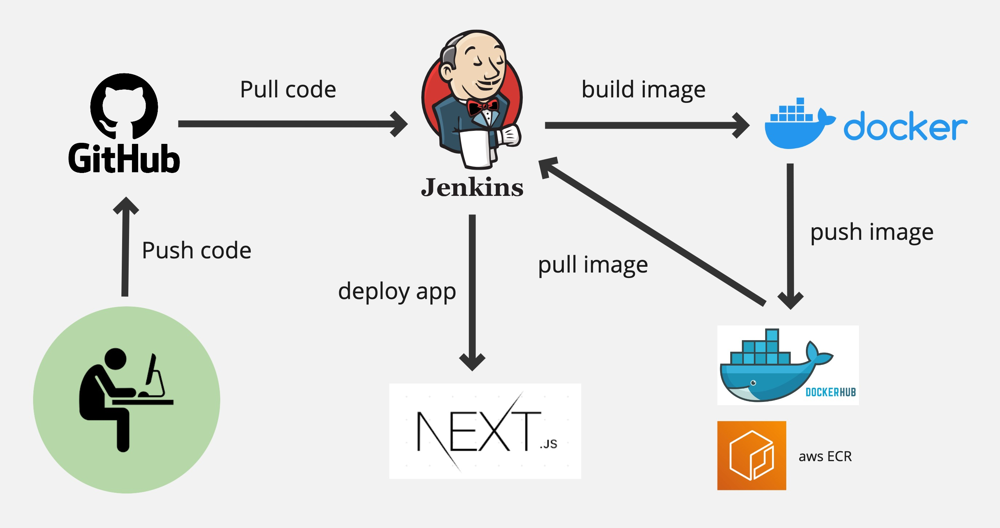

# Intergrate NextJs app with Jenkins for CICD

# 1. Functional Requirements
### 1.1 User Management
- Login and Signup System:
  - Users can register with email and password or via third-party OAuth (e.g., Google, Facebook).
  - Secure authentication to protect user data.
- Profile Management:
  - Users can manage their profile information (e.g., username, email).
  - Password reset functionality.
### 1.2 Habit Tracker
- Habit Input Panel:
  - A text field on the left-hand side (1/4 of the screen width) for adding and listing habits.
  - Users can add, edit, or delete habits.
  - Maximum of 10 habits visible at once, with the ability to scroll if more are added.
- Date Grid:
  - The right-hand side (3/4 of the screen width) displays a grid of dates and habits.
  - Rows represent habits; columns represent dates.
The grid focuses on the current day at the center, with the past and future dates visible.
Scrolling left or right dynamically loads additional dates (infinite scrolling).
- Habit Completion Marking:
  - Clicking on a grid cell toggles the habit's status for that day (e.g., completed or not).
  - Completed cells change color (e.g., green for done, red for missed).
### 1.3 Data Persistence
- Database Integration:
  - All user data (habits, completion status, statistics) is stored in a secure database.
  - Data is automatically saved when changes are made.
- Sync Across Devices:
  - Users can log in on different devices and access the same data.
### 1.4 Statistics
- Monthly Overview:
  - A summary of habit performance for the selected month.
  - Includes:
    - Number of habits completed per day.
    - Percentage of days habits were completed.
    - Visualizations such as bar charts or pie charts.
- Custom Date Range:
  - Option to view statistics for a specific range of dates.

# 2. Non-Functional Requirements
### 2.1 Usability
- The interface should be simple and intuitive for users of all experience levels.
- The app should support accessibility features, such as keyboard navigation and screen readers.
### 2.2 Performance
- The app should load quickly, even when displaying large datasets.
- Smooth scrolling for navigating between dates.
### 2.3 Security
- User passwords must be hashed and stored securely in the database.
- Ensure secure communication with HTTPS.
### 2.4 Compatibility
- Cross-platform and cross-browser support (e.g., Chrome, Firefox, Safari, Edge).
- Fully responsive design to work seamlessly on both desktop and mobile devices.
### 2.5 Scalability
- The app should handle a large number of users without significant performance degradation.
- Efficient database queries for handling multiple habits and long-term data.

# 3. Technical Requirements
### 3.1 Frontend
- Framework: React.js (for dynamic and interactive UI).
- State Management: Redux or Context API (to manage global state like habits and dates).
Styling: Tailwind CSS or CSS-in-JS libraries for responsive design.
### 3.2 Backend
- Framework: Node.js with Express.js for handling API requests.
- Database: MongoDB (NoSQL) or PostgreSQL (SQL) to store user data.
- Authentication: JSON Web Tokens (JWT) or OAuth2 for secure user sessions.
### 3.3 API
- RESTful API for CRUD operations:
  - Add/Edit/Delete Habits.
  - Fetch and update habit status by date.
  - Fetch statistics data.
### 3.4 Deployment
- Hosting: AWS, Vercel, or Heroku for deploying the app.
- Database Hosting: MongoDB Atlas or AWS RDS.
- Version Control: Git/GitHub for source code management.
### 3.5 Testing
- Unit Testing: Jest for frontend and backend logic.
- End-to-End Testing: Cypress to test user flows like adding habits and marking completions.

# 4. User Flow
- Sign Up: User registers and logs in.
- Add Habits: User adds habits through the input panel.
Mark Completion: User clicks on a grid cell to mark a habit as complete for a specific date.
- Scroll Through Dates: User scrolls left or right to view past and future dates.
- View Statistics: User checks the statistics panel for performance insights.
- Logout: User logs out; data remains saved in the database.

# 5. Stretch Features (Optional)
Notifications: Daily reminders to complete habits.
- Custom Themes: Light/Dark mode or custom color schemes.
- Drag-and-Drop Reordering: Reorder habits by priority.
- Gamification: Add streaks or badges for achieving goals.
